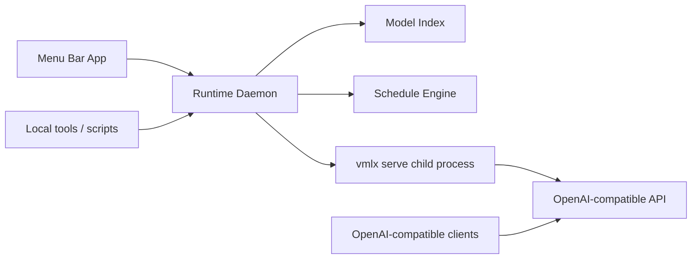

# Architecture

## Goal

Build a macOS-only local LLM product that makes `vMLX` feel like a desktop app instead of a shell workflow.

## Core Principle

Do not replace `vMLX`.
Wrap it with a better control plane.

## Components

### 1. Runtime Daemon

Path: `runtime/`

Responsibilities:

- scan local model directories
- classify models as MLX or JANG/vMLX
- start and stop a managed `vmlx serve` process
- keep runtime state on disk
- apply time-based schedule rules
- expose a small control API for the menu bar app and scripts

### 2. Managed Inference Runtime

Path: external dependency

Responsibilities:

- serve the currently loaded model through the standard OpenAI-compatible `vmlx` API

Notes:

- this runs as a child process managed by the daemon
- inference traffic should use the runtime API port, not the control port

### 3. Menu Bar App

Path: `Sources/VmlxStationMenuBar/`

Responsibilities:

- show current loaded model
- show daemon reachability
- list discovered models
- allow manual load and unload
- show basic schedule status

This app does not run the model directly.
It talks to the daemon.

## Ports

- control API: `127.0.0.1:18100`
- managed inference API: `127.0.0.1:18083`

## Data Flow

## Why split UI and daemon

- model control should survive UI restarts
- the API should remain available even if the menu bar app crashes
- a daemon is easier to automate with launchd
- a native menu bar app stays small and responsive

## Model Compatibility Strategy

`vMLX Station` uses a compatibility-first strategy:

- if a directory has `jang_config.json`, treat it as JANG/vMLX
- if a directory has `config.json`, treat it as MLX-capable
- keep model metadata thin and local
- let `vmlx` be the final authority on runtime compatibility

## Scheduling Strategy

The schedule layer is intentionally simple in v1:

- a list of time ranges
- each range maps to one model id
- one active rule at a time
- cross-midnight windows are supported

Example:

- `06:00 -> 23:00` = `gemma-4-e4b-it`
- `23:00 -> 06:00` = `Gemma-4-31B-JANG_4M-CRACK`

## Packaging Strategy

Phase 1:

- open-source repo
- run daemon from Python venv
- build menu bar app with Swift package tooling

Phase 2:

- signed app bundle
- bundled daemon bootstrap
- guided dependency checks

